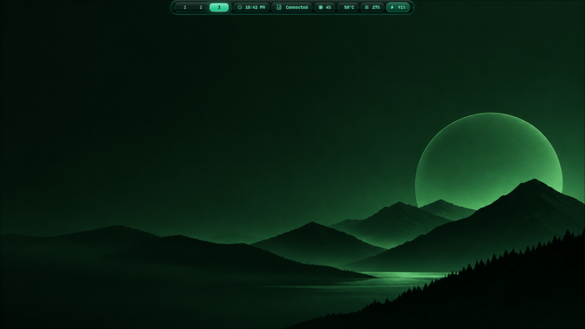

<div align="center">

# 🌌 Astraeus Hyprland Dotfiles

**A modern, high-performance, and aesthetic Hyprland (Wayland) desktop environment for Arch Linux.**

[](https://archlinux.org/)
[](https://hyprland.org/)
[](https://github.com/catppuccin/catppuccin)
[](LICENSE)

<br/>

[⬇️ **Download Latest Release (.zip)**](https://github.com/amitpadhan525/linux-dotfiles/releases/latest/download/linux-dotfiles.zip)

<br/>



</div>

---

## ✨ Features

- 🎨 **Catppuccin Mocha Palette**: Cohesive, gorgeous truecolor theme spanning Kitty, Waybar, Rofi, Dunst, GTK, and Hyprlock.
- ⚡ **Lua-Powered Hyprland (v0.55+)**: Clean, programmatic configuration layout for keybindings, monitors, window rules, and animations.
- 📊 **Dynamic Waybar**: Custom modular status bar with workspace indicators, media player, hardware telemetry, battery, and network status.
- 🚀 **Automated Tooling**: Comprehensive scripts for installation (`install.sh`), updates (`update.sh`), uninstallation with safe rollback (`uninstall.sh`), and system sync (`copy.sh`).
- 📋 **Integrated Utilities**: Clipboard management with `cliphist`, screenshot capture via `grim`/`slurp`, screen recording, night shift filter (`hyprsunset`), and dynamic wallpapers.
- 🔤 **Typography**: JetBrains Mono Nerd Font, Font Awesome, Inter, Outfit, and Noto Fonts.

---

## 🗂️ Repository Structure

```text
linux-dotfiles/
├── assets/                  # Previews, screenshots, and visual assets
├── hyprland/                # Core configuration files for deployment
│   ├── hypr/                # Hyprland lua/conf files, hyprlock, hyprpaper, scripts
│   ├── waybar/              # Waybar bar configurations, CSS styling, and scripts
│   ├── rofi/                # App launcher, clipboard, and power menu themes
│   ├── kitty/               # Terminal emulator configuration and colors
│   ├── dunst/ / mako/       # Notification daemon styles
│   ├── hyprfm/              # Lightweight file manager settings
│   ├── gtk-3.0/ / gtk-4.0/  # GTK theme presets and configurations
│   ├── nwg-dock-hyprland/   # Floating dock configuration
│   └── xsettingsd/          # XWayland bridge configuration
├── install.sh               # Interactive automated deployment script
├── update.sh                # Automated updater and configuration sync script
├── uninstall.sh             # Symlink removal and backup rollback utility
├── copy.sh                  # Helper to pull local system configs back into repository
├── RESOURCES.md             # Complete blueprint and package dependency index
└── LICENSE                  # MIT License
```

---

## 🚀 Quick Start

### 1. Clone the Repository
```bash
git clone https://github.com/amitpadhan525/linux-dotfiles.git
cd linux-dotfiles
```

### 2. Run the Installer
```bash
chmod +x install.sh
./install.sh
```

> **Note**: The installation script will automatically check dependencies, create backups in `~/.config/backups/`, and symlink configuration files into place.

#### Installer Options
```bash
./install.sh [OPTIONS]

  -y, --non-interactive   Run without interactive prompts
  -n, --no-backup         Skip automatic backup creation
  -d, --dry-run           Simulate actions without modifying the filesystem
  -p, --packages-only     Install package dependencies only
  -c, --configs-only      Deploy configurations only
  -h, --help              Show help message
```

---

## 🔄 Management & Maintenance

### 🔁 Updating Configurations
Pull latest repository changes and re-link configurations:
```bash
./update.sh
```

### 📤 Syncing Local Changes
To export your active system configs back into this repository:
```bash
./copy.sh
```

### 🗑️ Uninstalling & Rollback
To remove managed symlinks and optionally restore previous configuration backups:
```bash
./uninstall.sh
```

---

## ⌨️ Essential Keybindings

The default `SUPER` modifier key is the **Windows / Command key**.

| Keybinding | Action |
| :--- | :--- |
| <kbd>SUPER</kbd> + <kbd>Return</kbd> | Open Kitty Terminal |
| <kbd>SUPER</kbd> + <kbd>D</kbd> | Open Rofi App Launcher |
| <kbd>SUPER</kbd> + <kbd>E</kbd> | Open File Manager (`hyprfm`) |
| <kbd>SUPER</kbd> + <kbd>V</kbd> | Open Clipboard History |
| <kbd>SUPER</kbd> + <kbd>Q</kbd> | Close Focused Window |
| <kbd>SUPER</kbd> + <kbd>F</kbd> | Toggle Floating Mode |
| <kbd>SUPER</kbd> + <kbd>Space</kbd> | Toggle Fullscreen / Maximized |
| <kbd>SUPER</kbd> + <kbd>G</kbd> | Toggle Tabbed Group |
| <kbd>SUPER</kbd> + <kbd>U</kbd> | Toggle Scratchpad Workspace |
| <kbd>SUPER</kbd> + <kbd>P</kbd> | Open Power Menu |
| <kbd>SUPER</kbd> + <kbd>L</kbd> | Lock Screen (`hyprlock`) |
| <kbd>SUPER</kbd> + <kbd>S</kbd> | Area Screenshot |
| <kbd>SUPER</kbd> + <kbd>Shift</kbd> + <kbd>S</kbd> | Screen Recording |
| <kbd>SUPER</kbd> + <kbd>Alt</kbd> + <kbd>W</kbd> | Cycle Wallpaper |
| <kbd>SUPER</kbd> + <kbd>N</kbd> | Toggle Night Shift (`hyprsunset`) |
| <kbd>SUPER</kbd> + <kbd>W</kbd> | Cycle Waybar Layout |
| <kbd>SUPER</kbd> + <kbd>H</kbd>/<kbd>J</kbd>/<kbd>K</kbd>/<kbd>L</kbd> | Move Focus (Vim Navigation) |
| <kbd>SUPER</kbd> + <kbd>1-9</kbd> | Switch to Workspace 1-9 |
| <kbd>SUPER</kbd> + <kbd>Shift</kbd> + <kbd>1-9</kbd> | Move Window to Workspace 1-9 |

---

## 🎨 Customization

- **Keybindings & Rules**: Customize in `hyprland/hypr/conf/keybinding.lua` and `hyprland/hypr/conf/windowrules.lua`.
- **Status Bar**: Configure modules in `hyprland/waybar/config.jsonc` and styling in `hyprland/waybar/style.css`.
- **Wallpapers**: Place custom wallpapers inside `hyprland/hypr/wallpapers/`.
- **Terminal**: Tweak fonts, padding, and opacity in `hyprland/kitty/kitty.conf`.
- **Detailed Blueprint**: See [RESOURCES.md](RESOURCES.md) for package breakdowns, fonts, audio pipelines, and manual setup guides.

---

## 📜 License

This project is licensed under the [MIT License](LICENSE).
